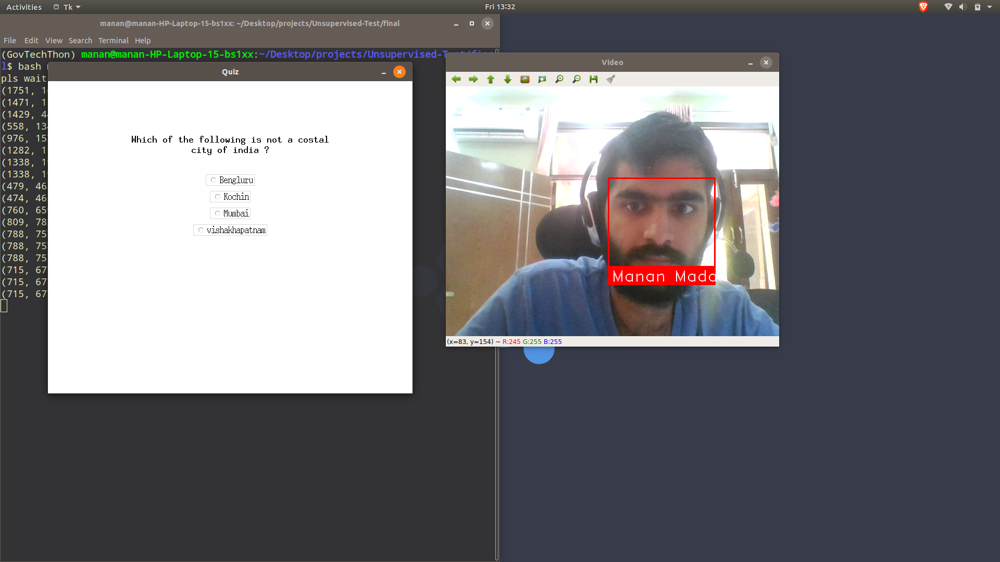

# AI Proctoring System

## Features
- GUI for test taking
- User Authentication
- Face Verification
- Mouse Location Tracking to detect cheating
- Facial Tracking during exam to detect fraud

## Output
[](https://youtu.be/NWWo4Ojeo4w)
- Click on the image to see the output vedio

## Installation
-Install conda ( https://www.digitalocean.com/community/tutorials/how-to-install-the-anaconda-python-distribution-on-ubuntu-20-04 )
-Run the following command to create conda environment via environment.yml
```
conda env create --file=environment.yml
```
-activate the environment
```
conda activate GovTechThon
```
-run the main.sh file via
```
bash main.sh
```
## Error
- In Case of error "27667 Illegal instruction     (core dumped)" update dlib via:
```
pip uninstall face_recognition
pip uninstall dlib
pip install CMake
pip insall dlib
pip install face_recognition
```

## Future Scope
- Creditability score using the performance and cheating instances!
- Object Detection to detect objects through which cheating can be done!
- Web version?

